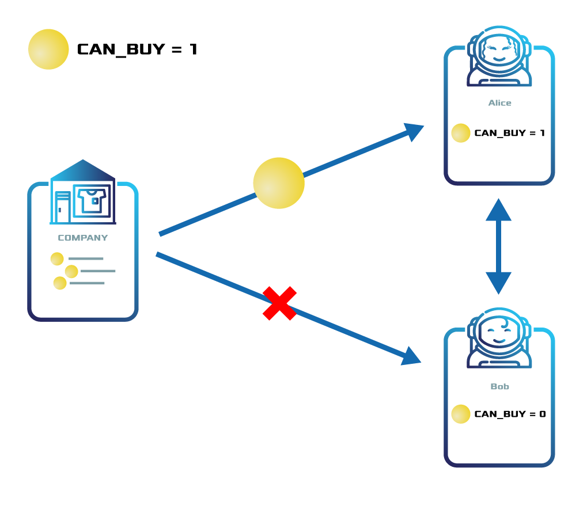
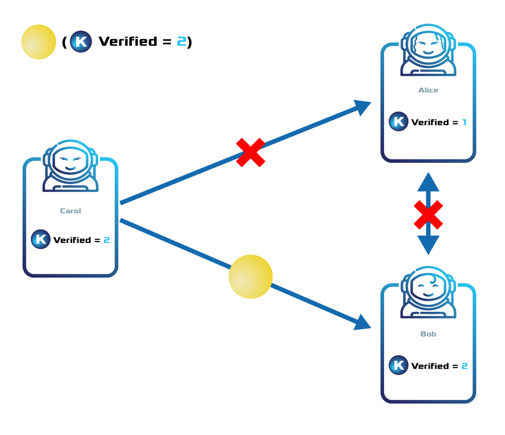

##################
Token Restriction
##################

Token restrictions allow :doc:`token <token>` creators to decide which accounts can transact with the asset.

This feature has been specifically tailored for **Security Token Offerings (STO)**.
In contrast to the unregulated tokens that were introduced through ICOs, security tokens are blockchain based representation of value that is subject to regulation under security laws, and thus need a way to bypass blockchain autonomy.

Not all the tokens of a given network will be subject to token restrictions.
The feature will only affect those to which the issuer adds the ``restrictable`` :ref:`property <configurable-token-properties>` explicitly at the moment of its creation.
This property appears disabled by default, as it is undesirable for autonomous tokens like the public network currency.

.. note:: A token only supports the token restrictions feature if the ``restrictable`` property has been set to true at its creation.

Token restrictions are **editable** over time, empowering the token creator to control who can send and receive the token as needed.

******************
Global restriction
******************

The token global restrictions are the **network-wide rules** that will determine whether an account will be able to send or receive a given token.

One token can handle up to ``20`` global restrictions, being this parameter :ref:`configurable per network <config-network-properties>`.
A :ref:`tokenglobalrestrictiontransaction` is composed of:

.. csv-table::
    :header: "Property", "Type", "Description"
    :delim: ;

    Token Id; TokenId; Identifier of the affected token. The token creator must be the signer of this transaction.
    Restriction Key; uint64; Restriction key.
    Restriction Value; uint64; Restriction value.
    Restriction Type; uint8; Type of constraint to apply. For example, the restriction value should be equal (EQ). See more :ref:`restriction types <tokenrestrictiontype>`.

Only accounts tagged with the key identifiers and values that meet the conditions will be able to execute transactions involving the token.

Additionally, the token creator can define restrictions that depend directly on global restrictions set on another token—known as **reference token**.
The referenced token and the restricted token do not necessarily have to be created by the same account, enabling the delegation of token permissions to a third party.

*******************
Address restriction
*******************

Enabling accounts to transact with the token is similar to the process of adding elevated permissions to a user in a company computer network.

The token creator can **modify the permissions of an account** by sending a token restriction transaction targeting the account address.
The :ref:`tokenaddressrestrictiontransaction` is composed of:

.. csv-table::
    :header: "Property", "Type", "Description"
    :delim: ;

    Token Id; TokenId; Identifier of the affected token. The token creator must be the signer of this transaction.
    Target Address; address; Affected address.
    Restriction Key; uint64; Restriction key.
    Restriction Value; uint64; Restriction value.

If the conditions match with the appropriate values set in the global restrictions, the account will be able to transact with the token.

Otherwise, the account needs to request the token creator to be granted elevated permissions or wait until the global restrictions are changed.

********
Examples
********

Verifying accounts that can buy assets
======================================

    Example of a token restriction

ComfyClothingCompany creates the token ``comfyclothing.shares``.
For regulatory reasons, the company wants only the participants that have passed the KYC process to buy and transact the asset.
Thus, the company adds the restriction tier ``{comfyclothing.shares, Can_Buy, EQ = 1}`` to the token ``comfyclothing.shares``.

Alice, a potential investor, is interested in investing in ComfyClothingCompany so she passes the KYC process.
Once Alice has been verified, the company tags Alice's account with the TokenAddressRestrictionTransaction  ``{comfyclothing.shares, Alice, Can_Buy, 1}``.

Alice can now buy ``comfyclothing.shares`` and start transacting it with other accounts.
Bob, on the other hand, is not be able to buy or even receive the asset because he is not verified and tagged accordingly.

Delegating the KYC process to a specialized company
===================================================

    Example of a delegated token restriction

Following the previous example, ComfyClothingCompany delegates the KYC process to a company specialized in KYC & AML.

The KYC provider registers a token named ``kyc`` and adds the token the global restriction ``{kyc, Is_Verified, EQ = 1}`` to the token.

The KYC provider also defines the following permission tiers:

.. csv-table::
    :header: "Key", "Operator", "Value", "Description"
    :delim: ;

    Is_Verified; EQ; 1; The client has issued a valid passport.
    Is_Verified; EQ; 2; The client has issued a valid proof of address and passport.

ComfyClothingCompany decides that only accounts with the restriction ``{ kyc::Is_Verified, 2}`` should be enabled to transfer ``cc.shares``.
For this reason, the company adds the global token restriction ``{comfyclothing.shares, kyc::Is_Verified, EQ = 2}``.

The KYC provider encounters 3 potential investors:

* Alice provides a valid passport but no proof of address. The KYC provider awards Alice’s account with the token restriction ``{kyc, Is_Verified, 1}``.
* Bob provides a valid passport and proof of address. The KYC provider awards Bob's account with the token restriction ``{kyc, Is_Verified, 2}``.
* Carol provides a valid passport and proof of address. The KYC provider awards Carol’s account with the token restriction ``{kyc, Is_Verified, 2}``.

Now, Bob and Carol will be able to buy and send the ``comfyclothing.shares`` units to each other.
Nevertheless, Alice⁠—who has not provided a valid proof of address—will not be able to receive shares.

********************
Related transactions
********************

.. csv-table::
    :header:  "Id",  "Type", "Description"
    :widths: 20 30 50
    :delim: ;

    0x4151; :ref:`tokenglobalrestrictiontransaction`; Set global rules to transfer a restrictable token.
    0x4251; :ref:`tokenaddressrestrictiontransaction`; Set address specific rules to transfer a restrictable token.

**************
Related guides
**************

.. postlist::
    :category: Token Restriction
    :date: %A, %B %d, %Y
    :format: {title}
    :list-style: circle
    :excerpts:
    :sort:
