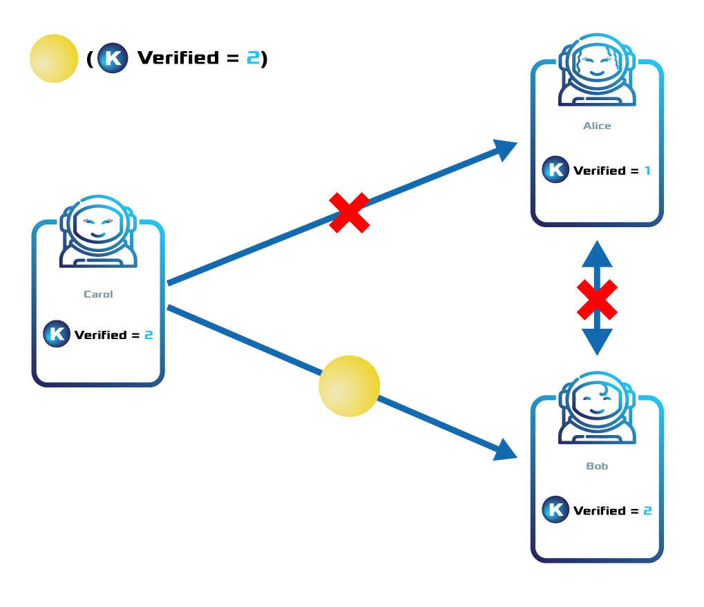

######
Token
######

Tokens are **fixed assets** that represent a set of multiple identical things that do not change.

A token can be what is conventionally called **a token**, but it can also be a collection of more specialized assets such as reward points, shares of stock, signatures, status flags, votes or other currencies, for example.

Token specialization is achieved through its properties, which are set during :doc:`token creation <../guides/token/creating-a-token>`.

Once created, each token has a unique identifier represented as a 64-bit unsigned integer. For example, |codename|'s native currency, **BXR**, has the token ID ``0x3D1FE6EDC7F9611E``.

.. note:: If you create a token which should be used by other users, it is very convenient to use a :doc:`namespace` to alias the token ID to a human-readable string. BXR use the |networkcurrency| alias, for example.

.. _configurable-token-properties:

*****************
Token Properties
*****************

Divisibility
============

Determines the number of **decimal places** to which the token can be divided. A divisibility of **3** means that the smallest fraction a token can be divided into is **0.001**.

When decimals are used units are called **relative**, and when no decimals are used units are called **absolute**. I.e., with a divisibility of 3, **1** absolute unit corresponds to **0.001** relative units. To convert from relative to absolute units multiply by 10\ :sup:`divisibility`.

Divisibility must be in the **0** to **6** range (included).

Initial supply
==============

Indicates the amount of tokens initially in circulation, in **absolute units**.

This amount can be later changed by a :ref:`tokensupplychangetransaction` if the **Supply mutable** flag (see below) of the token is set to true.

The total supply must be in the **0** to **800,000,000** range in absolute units.

Duration
========

Specifies the number of confirmed blocks the token is rented for.

**Expiring tokens** are allowed to lie in |codename|'s public network up to **3650** days (10 years), being this maximum parameter :ref:`editable per network <config-network-properties>`.

**Non-expiring tokens** can be created by setting this property to **0**.

.. note:: Token duration cannot be extended after its creation. Before creating one, consider if your use case requires the token to expire or not. Note that this behavior is different for :doc:`Namespaces <namespace>`.

The following formula is used to convert days to blocks approximately:

.. math::

    duration ≈ \frac{numberOfDays * 86400}{blockGenerationTargetTimeInSeconds}

By default, ``blockGenerationTargetTimeInSeconds`` is **30** seconds.

Supply mutable
==============

If set to true, the token supply can change at a later point.
In this case, the token creator is allowed to redefine the total token supply with a :ref:`tokensupplychangetransaction`.
The transaction increases or decreases the token supply in ``delta`` units.

To decrease the token supply, the token creator account must own at least ``delta`` units.
This means that the token creator cannot remove tokens from other account balances, even if the supply mutable property is enabled.

If Supply mutable set to false, the token supply cannot be changed.
However, if the token creator owns all the token supply, this is modifiable even if the token is defined as not mutable.

Transferable
============

    Example of a non-transferable token

If set to true, the token can be transferred between arbitrary accounts.
Otherwise, the token can only be transferred to or from the token creator.

Restrictable
============

    Example of a token restriction

If set to true, the token creator can configure custom :doc:`restrictions <token-restriction>`.

Revokable
=========

Tokens can be revoked (i.e., **reclaimed**) by the token creator when this flag is set to true.

.. _token-rental-fee:

************
Creation fee
************

An account willing to create a token has to pay a rental fee in addition to the :doc:`transaction fee <fees>`.
Both fees will be deducted from the account's balance after the announcement of a valid :ref:`tokendefinitiontransaction`.

The :doc:`REST Gateway <../api>` provides an endpoint to get an estimation of how much network currency will cost you to create a token:

.. example-code::

    .. viewsource:: ../resources/examples/typescript/token/GettingTokenRentalFee.ts
        :language: typescript
        :start-after: /* start block 01 */
        :end-before: /* end block 01 */

    .. viewsource:: ../resources/examples/typescript/token/GettingTokenRentalFee.js
        :language: javascript
        :start-after: /* start block 01 */
        :end-before: /* end block 01 */

By default, creating a token in |codename|'s public network has an initial cost of **0.5** |networkcurrency| (:ref:`configurable per network <config-network-properties>` by the ``tokenRentalFee`` property).
However, **the network dynamically adjusts the token rental fee** over time.

To calculate the effective rental fee, the network multiplies the default value set in the configuration by the network's :ref:`dynamic fee multiplier <fees_dynamic_multiplier>`.

********************
Related transactions
********************

.. csv-table::
    :header:  "Id",  "Type", "Description"
    :widths: 15 45 40
    :delim: ;

    0x414D; :ref:`tokendefinitiontransaction`; Create a new token.
    0x424D; :ref:`tokensupplychangetransaction`; Change the token total supply.
    0x434D; :ref:`tokensupplyrevocationtransaction`; Reclaim transferred tokens.

**************
Related guides
**************

.. postlist::
    :category: Token
    :date: %A, %B %d, %Y
    :format: {title}
    :list-style: circle
    :excerpts:
    :sort:
