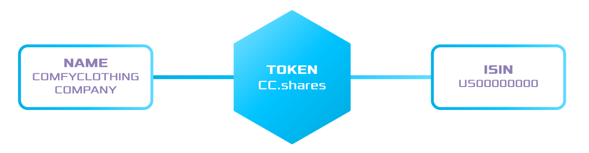

.. post:: 01 Oct, 2019
    :category: Metadata
    :tags: SDK, CLI
    :excerpt: 1
    :nocomments:

##############################
Assigning metadata to a token
##############################

Add custom data to a token.

********
Use case
********

Metadata is a |codename| feature that can be used to attach information about :doc:`tokens <../../concepts/token>`.
For example, small pieces of data such as legal name, ticker, or ISIN, can be assigned as on-chain :doc:`metadata<../../concepts/metadata>`, while sizable documents, like the prospectus or investor agreement, can be kept off-chain.

In this tutorial, you are going to implement a program to add relevant data to a token.
Imagine that the company ComfyClothingCompany has applied for an |ISIN-code| to conduct an STO.
After receiving the code ``US0000000000``, the company decided to represent the company shares creating a token named ``cc.shares``.
Before distributing the shares between the investors, ComfyClothingCompany wants to attach its ISIN code and legal name to the shares definition.

*************
Prerequisites
*************

- Complete the :doc:`getting started section <../../getting-started/setup-workstation>`.
- Create a new :ref:`account <setup-creating-a-test-account>`.
- Load the account with enough |networkcurrency| to pay for transaction fees, create tokens and register namespaces.

*******************
Creating the shares
*******************

1. Create a token to represent the shares.
The token we are creating will have the properties ``supplyMutable``, ``transferable``, ``restrictable``, ``non-expiring``, and we will be able to operate with up to 2 decimal places.

.. code-block:: bash

    bitxor-cli transaction token --sync

    Do you want an non-expiring token? [y/n]: y
    Enter token divisibility: 2
    Do you want token to have supply mutable? [y/n]: y
    Do you want token to be transferable? [y/n]: y
    Do you want token to be restrictable? [y/n]: y
    Enter max_fee (absolute amount): 0
    Enter amount of tokens: 100
    The new token id is:  2C08D5EDB652AA79
    Transaction confirmed.

2. To make the token easily identifiable in the network, create the namespace ``cc`` and the subnamespace ``cc.shares``.

.. code-block:: bash

    bitxor-cli transaction namespace --sync

    Enter namespace name: cc
    Do you want to create a root namespace? [y/n]: y
    Enter the namespace rental duration: 172800
    Enter max_fee (absolute amount): 0
    Transaction confirmed.

.. code-block:: bash

    bitxor-cli transaction namespace --sync

    Enter namespace name: shares
    Do you want to create a root namespace? [y/n]: n
    Enter the parent namespace name: cc
    Enter max_fee (absolute amount): 0
    Transaction confirmed.

3. Link the subnamespace ``cc.shares`` with the ``tokenId`` you have created in the first step.

.. code-block:: bash

    bitxor-cli transaction tokenalias --sync

    Enter namespace name: cc.shares
    Enter alias action (1: Link, 0: Unlink): 1
    Enter token in hexadecimal format: 2C08D5EDB652AA79
    Enter max_fee (absolute amount): 0
    Transaction confirmed.

*************************
Method #01: Using the SDK
*************************

1. Now that you have created ``cc.shares``, define two ``TokenMetatadaTransaction`` to add the **ISIN** and **legal name** to the token:

A) Key: ``ISIN``, Value: ``US00000000``.

.. example-code::

    .. viewsource:: ../../resources/examples/typescript/metadata/AssigningMetadataToAToken.ts
        :language: typescript
        :start-after:  /* start block 01 */
        :end-before: /* end block 01 */

    .. viewsource:: ../../resources/examples/typescript/metadata/AssigningMetadataToAToken.js
        :language: javascript
        :start-after:  /* start block 01 */
        :end-before: /* end block 01 */

B) Key: ``NAME``, Value: ``ComfyClothingCompany``.

.. example-code::

    .. viewsource:: ../../resources/examples/typescript/metadata/AssigningMetadataToAToken.ts
        :language: typescript
        :start-after:  /* start block 02 */
        :end-before: /* end block 02 */

    .. viewsource:: ../../resources/examples/typescript/metadata/AssigningMetadataToAToken.js
        :language: javascript
        :start-after:  /* start block 02 */
        :end-before: /* end block 02 */

2. All metadata is attached only with the consent of the token creator through Aggregate Transactions.
Wrap the **metadata transactions** inside an :ref:`AggregateCompleteTransaction <aggregate-complete>` and sign the aggregate with the company's account.

.. example-code::

    .. viewsource:: ../../resources/examples/typescript/metadata/AssigningMetadataToAToken.ts
        :language: typescript
        :start-after:  /* start block 03 */
        :end-before: /* end block 03 */

    .. viewsource:: ../../resources/examples/typescript/metadata/AssigningMetadataToAToken.js
        :language: javascript
        :start-after:  /* start block 03 */
        :end-before: /* end block 03 */

.. note:: In this example, the account signing the transaction is the creator of the token. For that reason, the aggregate can be defined as complete. If a different account owned the token, you would set the :ref:`aggregate as bonded <aggregate-bonded>`, and the token creator would opt-in the metadata request by :doc:`cosigning the transaction <../aggregate/signing-announced-aggregate-bonded-transactions>`.

3. Sign and announce the **AggregateTransaction** to the network.

.. example-code::

    .. viewsource:: ../../resources/examples/typescript/metadata/AssigningMetadataToAToken.ts
        :language: typescript
        :start-after:  /* start block 04 */
        :end-before: /* end block 04 */

    .. viewsource:: ../../resources/examples/typescript/metadata/AssigningMetadataToAToken.js
        :language: javascript
        :start-after:  /* start block 04 */
        :end-before: /* end block 04 */

4. When the transaction gets confirmed, :doc:`fetch the token metadata entries <getting-metadata-entries-attached-to-a-token>`.

.. |ISIN-code| raw:: html

   <a href="https://en.wikipedia.org/wiki/International_Securities_Identification_Number" target="_blank">ISIN code</a>

.. |STO| raw:: html

   <a href="https://en.wikipedia.org/wiki/STO" target="_blank">STO</a>

*************************
Method #02: Using the CLI
*************************

Open a terminal window and run the following command.

Replace ``BXR6YD-BC3BW2-ZYXOXC-HHIRDV-MEZUIP-BRISYI-TPQ`` with the token owner address, ``2C08D5EDB652AA79`` with the target token id.
Then, change ``BC2FC3ACFF58FF89`` with a key, and ``US00000000`` with the value you want to attach as metadata.

.. note:: You can use the command ``bitxor-cli converter stringtokey`` to transform an string (e.g. ``ISIN``) into a valid UInt64 key (``2C08D5EDB652AA79``).

.. viewsource:: ../../resources/examples/bash/metadata/AssigningMetadataToAToken.sh
    :language: bash
    :start-after: #!/bin/sh

