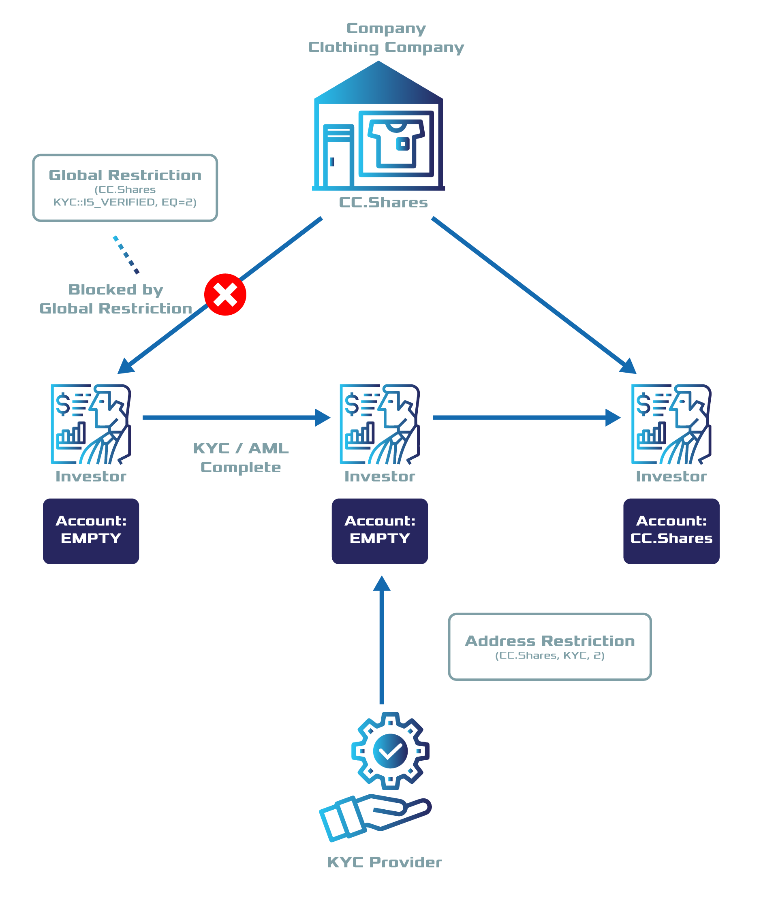

.. post:: 20 Sep, 2019
    :category: Token Restriction
    :tags: SDK
    :excerpt: 1
    :nocomments:

###############################################
Delegating token restrictions to a third party
###############################################

Allow another account to add restrictions to your tokens.

********
Use case
********

Another company, **ComfyClothingCompany** wants to conduct an STO.
In this case, they want to **delegate the KYC process** to a company specialized in KYC & AML.

If you have followed the previous guide (:doc:`restricting tokens transfers <restricting-tokens-transfers>`), you know how to restrict accounts from transacting a given token by combining different key-values to match the global :doc:`token restriction <../../concepts/token-restriction>`.

    Use case diagram

In this guide, we will be restricting accounts to trade with ``cc.shares``—token created by ComfyClothingCompany—if the KYC provider does not allow them.

*************
Prerequisites
*************

- Complete :doc:`restricting tokens transfers <restricting-tokens-transfers>` guide.
- Create :ref:`accounts <setup-creating-a-test-account>` for ComfyClothingCompany and KYC provider.
- Load both accounts with enough |networkcurrency| to pay for the transactions fees and creation of tokens.

*************************
Method #01: Using the SDK
*************************

1. Start by creating a new ``restrictable`` token,
We will refer to this token from now on as ``cc.shares``.

.. code-block:: bash

    bitxor-cli transaction token --amount 1000000 --transferable --supply-mutable --restrictable --divisibility 0 --non-expiring --profile cccompany --sync

    The new token id is: 7cdf3b117a3c40cc

2. The KYC provider registers a new token named ``kyc`` and adds the token global restriction ``{ kyc, IsVerified, EQ, 1}`` to the token.

.. example-code::

    .. viewsource:: ../../resources/examples/typescript/restriction/RestrictingTokensTransfersDelegatedTokenGlobalRestriction.ts
        :language: typescript
        :start-after:  /* start block 01 */
        :end-before: /* end block 01 */

    .. viewsource:: ../../resources/examples/typescript/restriction/RestrictingTokensTransfersDelegatedTokenGlobalRestriction.js
        :language: javascript
        :start-after:  /* start block 01 */
        :end-before: /* end block 01 */

The KYC provider defines the following permission tiers:

.. csv-table::
    :header: "Key", "Operator", "Value", "Description"
    :delim: ;

    IsVerified; EQ; 1; The client has issued a valid passport.
    IsVerified; EQ; 2; The client has issued a valid proof of address and passport.

ComfyClothingCompany decides that only accounts with the restriction ``{cc.shares, kyc::IsVerified, EQ = 2}`` should be enabled to transfer shares.
For this reason, the company adds the token global restriction ``{ kyc::IsVerified, EQ, 2}`` to the token  ``ccf.shares``.
To implement the restriction from another token, use the field ``referenceId``.

3. Announce a **TokenGlobalRestrictionTransaction**, setting ``cc.shares`` as the ``targetTokenId``, ``kyc`` as the ``referenceTokenId``, and ``IsVerified`` as the key.

.. example-code::

    .. viewsource:: ../../resources/examples/typescript/restriction/RestrictingTokensTransfersDelegatedTokenGlobalRestriction2.ts
        :language: typescript
        :start-after:  /* start block 01 */
        :end-before: /* end block 01 */

    .. viewsource:: ../../resources/examples/typescript/restriction/RestrictingTokensTransfersDelegatedTokenGlobalRestriction2.js
        :language: javascript
        :start-after:  /* start block 01 */
        :end-before: /* end block 01 */

4. The KYC provider has encounters three potential investors:

* Alice provides a valid passport but no proof of address. The KYC provider awards Alice's account with the token restriction ``{kyc, IsVerified, 1}``.
* Bob provides a valid passport and proof of address. The KYC provider awards Bob's account with the token restriction ``{kyc, IsVerified, 2}``.
* Carol provides a valid passport and proof of address. The KYC provider awards Carol's account with the token restriction ``{kyc, IsVerified, 2}``.

The KYC provider has to tag the accounts accordingly sending token address restrictions.

.. example-code::

    .. viewsource:: ../../resources/examples/typescript/restriction/RestrictingTokensTransfersDelegatedTokenAddressRestriction.ts
        :language: typescript
        :start-after:  /* start block 01 */
        :end-before: /* end block 01 */

    .. viewsource:: ../../resources/examples/typescript/restriction/RestrictingTokensTransfersDelegatedTokenAddressRestriction.js
        :language: javascript
        :start-after:  /* start block 01 */
        :end-before: /* end block 01 */

5. After the restrictions get confirmed, Bob and Carol will be able to buy and send the ``cc.shares`` units to each other.
But Alice⁠—who has not provided valid proof of address⁠—will not be able to receive shares.
