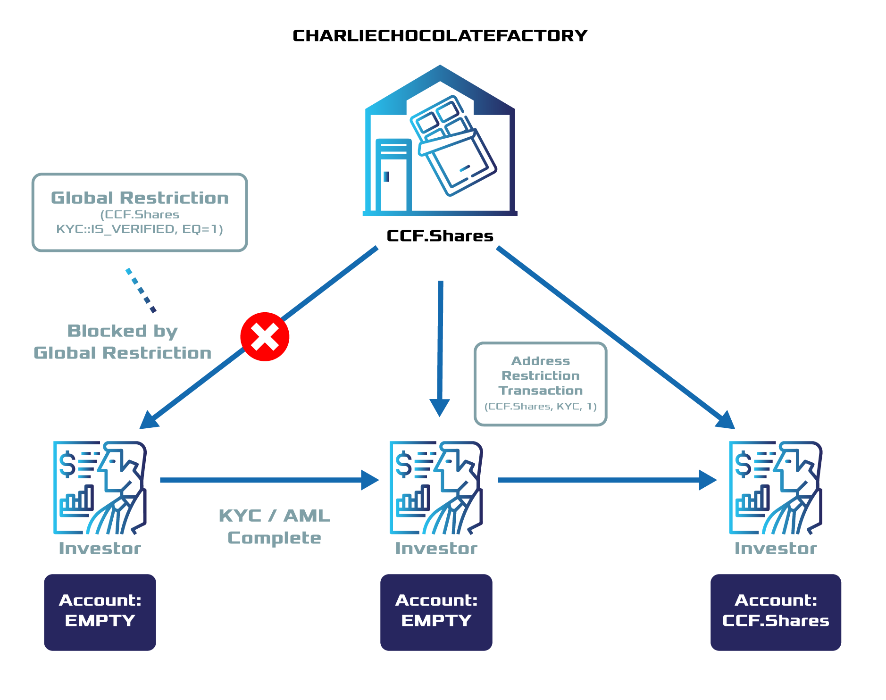

.. post:: 13 Sep, 2019
    :category: Token Restriction
    :tags: SDK
    :excerpt: 1
    :nocomments:

############################
Restricting token transfers
############################

Limit how accounts can transact with Token Restrictions.

********
Use case
********

Let's say a company, CharlieChocolateFactory, wants to go public by tokenizing their shares and conducting an STO. They create a token ``ccf.shares`` and configure it to be **restrictable**. To comply with regulations, the company wants only the participants that have passed the **KYC/AML** process to buy and transact their stock.

This guide shows you how to use |codename|'s :doc:`Token Restriction <../../concepts/token-restriction>` feature to define rules that determine which participants can transact with ``ccf.shares``.

*************
Prerequisites
*************

- Complete :doc:`creating a token <../token/creating-a-token>` guide.
- Create :ref:`accounts <setup-creating-a-test-account>` for CharlieChocolateFactory, Alice, And Bob.
- Load CharlieChocolateFactory's account with enough |networkcurrency| to pay for the transactions fees and creation of tokens.

******************************
Creating a restrictable token
******************************

Before starting to work with Token Restrictions, we need to have created a restrictable token. Only tokens with the ``restrictable`` :ref:`property <configurable-token-properties>` set to true at the moment of their creation can accept token restrictions.

1. Start creating the new restrictable token ``ccf.shares``.

.. code-block:: bash

    bitxor-cli transaction token --profile ccfactory --sync

    Do you want a non-expiring token? [y/n]: y
    Enter token divisibility: 0
    Do you want token to have supply mutable? [y/n]: y
    Do you want token to be transferable? [y/n]: y
    Do you want token to be restrictable? [y/n]: y
    Enter amount of tokens: 1000
    Transaction confirmed

    The new token id is: 634a8ac3fc2b65b3

2. Then, copy and save the token identifier. We will need it later to define restrictions.

***********************************
Setting a Token Global Restriction
***********************************

The company wants to add a restriction to only permit accounts with elevated statuses to interact with the asset. To achieve this, the company will add a token global restriction as ``{ccf.shares, KYC, EQ = 1}``, which can be read as "only allow accounts to transact with the ``ccf.shares`` token if their ``KYC`` restriction key for it has a value equal to 1".

    Use case diagram

1. Open a new file and place the token identifier value you got while creating the token in a variable named ``tokenId``. Also, you should represent the key ``KYC`` with a numeric value encoded as a UInt64.

.. example-code::

    .. viewsource:: ../../resources/examples/typescript/restriction/RestrictingTokensTransfersTokenGlobalRestriction.ts
        :language: typescript
        :start-after:  /* start block 01 */
        :end-before: /* end block 01 */

    .. viewsource:: ../../resources/examples/typescript/restriction/RestrictingTokensTransfersTokenGlobalRestriction.js
        :language: javascript
        :start-after:  /* start block 01 */
        :end-before: /* end block 01 */

2. Then, define a new **TokenGlobalRestrictionTransaction**. Pass the token id and keys you have defined in the previous step as arguments.

The SDK will also request the previous token restriction value and type for this key and token. As it is the first global restriction we are announcing, set the ``previousRestrictionValue`` to ``0`` and the ``tokenRestrictionType`` to ``None``.

.. example-code::

    .. viewsource:: ../../resources/examples/typescript/restriction/RestrictingTokensTransfersTokenGlobalRestriction.ts
        :language: typescript
        :start-after:  /* start block 02 */
        :end-before: /* end block 02 */

    .. viewsource:: ../../resources/examples/typescript/restriction/RestrictingTokensTransfersTokenGlobalRestriction.js
        :language: javascript
        :start-after:  /* start block 02 */
        :end-before: /* end block 02 */

3. After defining the global restriction, sign the transaction with the token creator's account—CharlieChocolateFactory—and announce it to the network.

.. example-code::

    .. viewsource:: ../../resources/examples/typescript/restriction/RestrictingTokensTransfersTokenGlobalRestriction.ts
        :language: typescript
        :start-after:  /* start block 03 */
        :end-before: /* end block 03 */

    .. viewsource:: ../../resources/examples/typescript/restriction/RestrictingTokensTransfersTokenGlobalRestriction.js
        :language: javascript
        :start-after:  /* start block 03 */
        :end-before: /* end block 03 */

*************************************
Assigning Token Address Restrictions
*************************************

When investors complete the KYC/AML process, the CharlieChocolateFactory alters their accounts with a **TokenAddressRestrictionTransaction** with parameters ``ccf.shares, KYC, 1``, allowing certified investors to participate in the STO. Others who have not provided the necessary information will not be able to receive or trade the asset.

Alice, a potential investor, passes the KYC process. Once Alice has been verified, the company tags Alice's account with the token address restriction ``{ccf.shares, Alice, KYC, 1}``. On the other hand, Bob, another interested investor, did not pass the KYC process. Bob’s account is not eligible to receive ``ccf.shares`` as it does not meet the token global restriction requirements. Nevertheless, CharlieCholocalteFatory decides to tag the account with the **token address restriction** ``{ccf.shares, Bob, KYC, 0}``. Doing so, they know that Bob has attempted and failed the KYC process.

1. Define both **TokenAddressRestrictionTransaction** for Alice and Bob accounts as follows:

* Alice: ``{ccf.shares, Alice, KYC, 1}``
* Bob:  ``{ccf.shares, Bob, KYC, 0}``

.. example-code::

    .. viewsource:: ../../resources/examples/typescript/restriction/RestrictingTokensTransfersTokenAddressRestriction.ts
        :language: typescript
        :start-after:  /* start block 01 */
        :end-before: /* end block 01 */

    .. viewsource:: ../../resources/examples/typescript/restriction/RestrictingTokensTransfersTokenAddressRestriction.js
        :language: javascript
        :start-after:  /* start block 01 */
        :end-before: /* end block 01 */

2. Now, you can announce the transactions to the network. To do so, try to announce both transactions together using an :doc:`aggregate transaction <../../concepts/aggregate-transaction>`. Remember that you will have to announce the transactions from the token's creator account.

.. example-code::

    .. viewsource:: ../../resources/examples/typescript/restriction/RestrictingTokensTransfersTokenAddressRestriction.ts
        :language: typescript
        :start-after:  /* start block 02 */
        :end-before: /* end block 02 */

    .. viewsource:: ../../resources/examples/typescript/restriction/RestrictingTokensTransfersTokenAddressRestriction.js
        :language: javascript
        :start-after:  /* start block 02 */
        :end-before: /* end block 02 */

3. Once the transaction gets confirmed, try to send tokens to Alice's and Bob's accounts.

Now, you should be able to send ``ccf.shares`` to Alice without any problems. Additionally, Alice will be able to transfer tokens with other accounts with restrictions set to ``{ccf.shares, KYC, 1}``.

.. code-block:: bash

     bitxor-cli transaction transfer --recipient-address BXRBDE-NCLKEB-ILBPWP-3JPB2X-NY64OE-7PYHHE-32I --tokens 634a8ac3fc2b65b3::1 --sync

However, when you send the same token to Bob's account, you should get the error ``Failure_RestrictionToken_Account_Unauthorized`` through the status error channel because he is not allowed to transact with ``ccf.shares``.
